#  MoodBoard AI

**Turn a rough creative idea into a clear visual direction — in minutes, not days.**

AI-assisted workspace for creative direction and moodboarding. Describe a brand refresh, campaign look, or product launch vibe — get a structured board with colors, fonts, reference images, notes, and brand guidance. Refine it, share with your team, and export when you're ready.

<p align="center">
  <a href="https://moodboard-ai-omega.vercel.app"><strong>Live demo</strong></a>
  ·
  <a href="https://github.com/NehangPatel23/Moodboard-AI">GitHub</a>
  ·
  <a href="docs/FEATURES.md">Features</a>
  ·
  <a href="docs/ROADMAP.md">Roadmap</a>
</p>

<p align="center">
  
  
  
  
  
  
</p>

---

## Table of contents

- [At a glance](#at-a-glance)
- [Screenshots](#screenshots)
- [What is this?](#what-is-this)
- [Why it exists](#why-it-exists)
- [How it works](#how-it-works)
- [App flow](#app-flow)
- [Traditional vs MoodBoard AI](#traditional-vs-moodboard-ai)
- [Who it's for](#who-its-for)
- [What you can do](#what-you-can-do)
- [Try it](#try-it)
- [FAQ](#faq)
- [For developers](#for-developers)
- [Documentation](#documentation)
- [License](#license)

---

## At a glance

| | |
|---|---|
| **Problem** | Creative briefs start vague; moodboards take hours to assemble manually |
| **Solution** | AI generates a structured first draft — palette, type, refs, notes — you refine and share |
| **Output** | Editable boards exportable as JSON, PNG, or PDF |
| **Collaboration** | Invites, roles, real-time presence, section-linked comments, activity replay, unread badges |
| **Status** | Portfolio complete · live demo · CI + smoke tests on `main` |

---

## Screenshots

Portfolio captures from the [live demo](https://moodboard-ai-omega.vercel.app):

| Surface | Preview |
|---------|---------|
| **Landing** — hero, capabilities, example board preview | 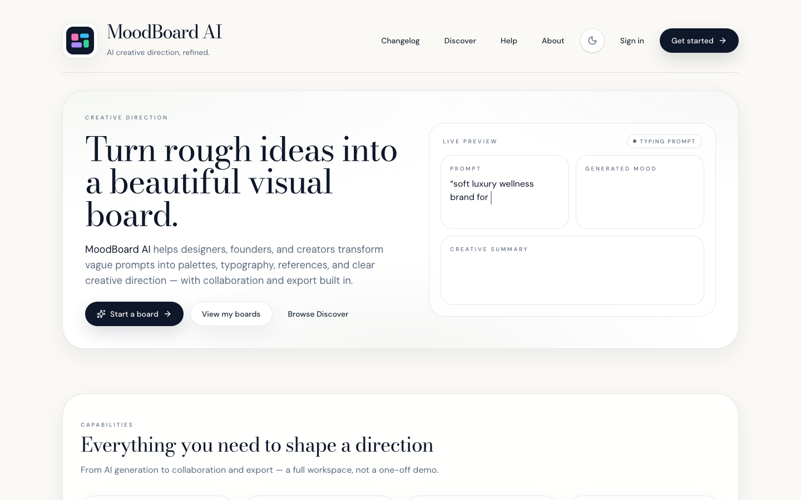 |
| **Discover** — mood dropdown, featured row, creator profiles | 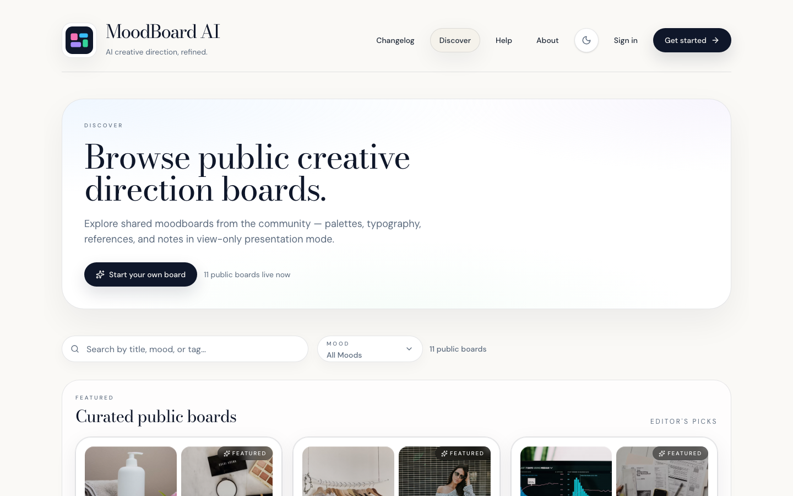 |
| **Dashboard** — board grid, filters, pending invitations | 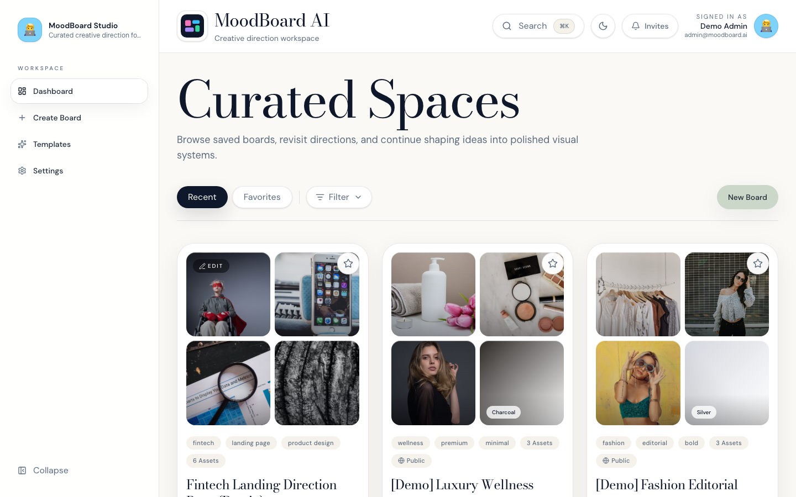 |
| **Board editor** — tabbed sections, palette, references | 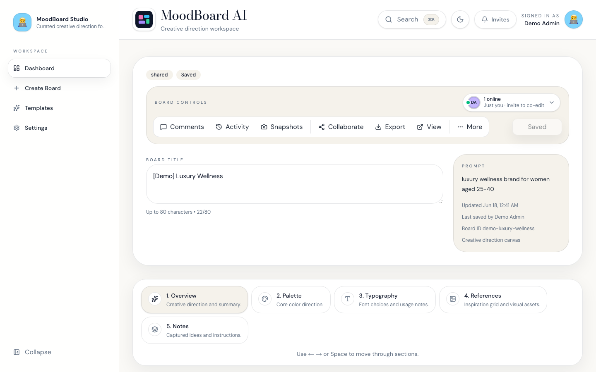 |
| **Collaboration** — comments panel, section context, team feedback | 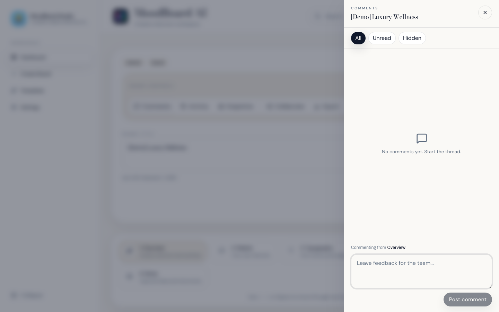 |
| **Share page** — view-only board, remix CTA, creator attribution | 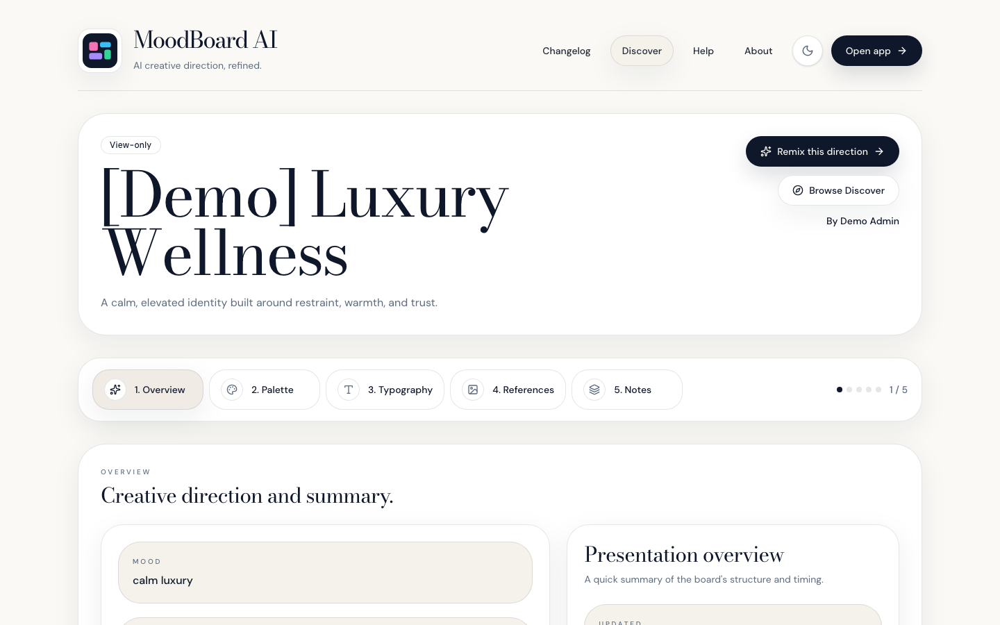 |
| **Settings** — display name, avatar, Editor auto-save interval | 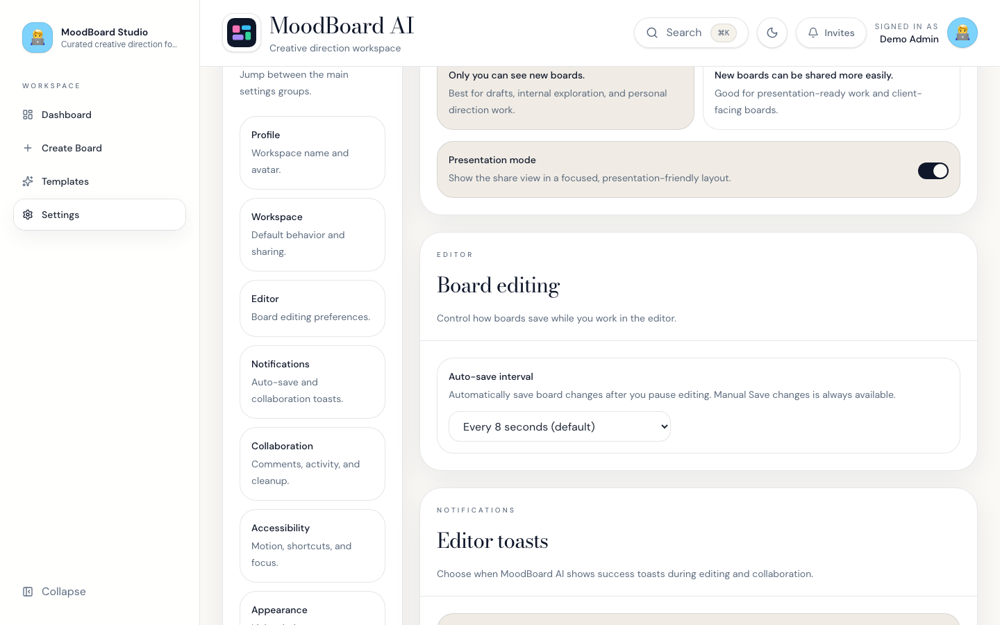 |
| **Sign-in** — email/password, forgot password, demo account | 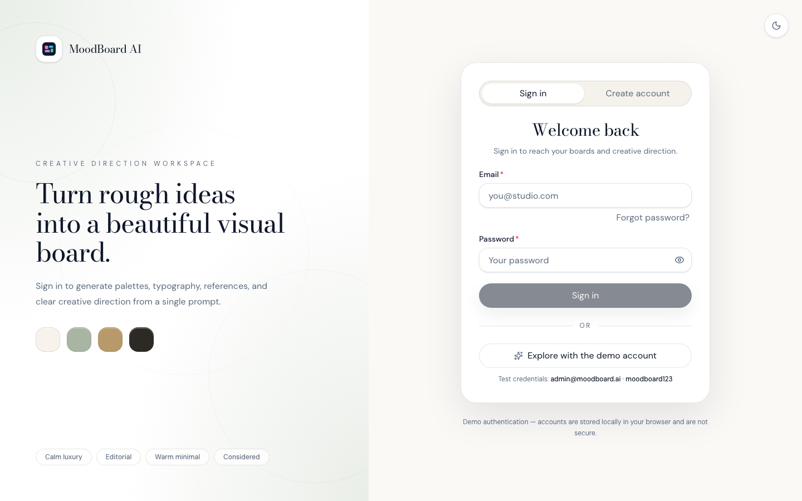 |

**Try the demo:** sign in with `admin@moodboard.ai` / `moodboard123`, or browse Discover without an account. Run `npm run db:seed-demo && npm run db:seed-demo-boards` locally to populate showcase boards.

To refresh captures: `npm run capture:screenshots` (requires `npx playwright install chromium` once)

---

## What is this?

A **moodboard** is a visual reference board used to capture the *feel* of a project before anything gets built — colors, typography, photography style, tone of voice, and layout inspiration.

Usually that means hours of Pinterest scrolling, screenshotting, and arranging things in Figma or Slides. **MoodBoard AI automates the first draft** so you start with something tangible instead of a blank page.

Each **board** is a living document:

| Section | What it holds |
|---------|----------------|
| **Overview** | Title, summary, mood, tone, tags, and brand strategy |
| **Palette** | Curated color swatches with names and roles |
| **Typography** | Font pairings for headings and body text |
| **References** | Inspiration photos (stock APIs or your own uploads) |
| **Notes** | Sticky notes and free-form direction |

Edit by hand, ask AI for suggestions, invite teammates, or export the result.

---

## Why it exists

Creative projects often start with language like *"make it feel premium but approachable"* or *"Scandinavian minimal meets streetwear."* Turning that into something a team can align on is slow and inconsistent.

MoodBoard AI was built to:

1. **Reduce blank-page friction** — go from a sentence to a structured board quickly
2. **Keep creative direction organized** — one place for palette, type, refs, and notes
3. **Make collaboration practical** — share, comment, see who's editing, replay changes
4. **Feel like a real product** — save, export, discover public boards, use it day to day

> Long-term vision: **the creative director, moodboard, and design toolkit in one place — powered by AI.**

This is a self-directed portfolio build designed to feel premium and app-like, not a throwaway demo.

---

## How it works

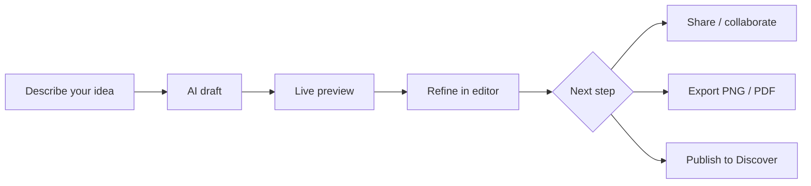

### Step by step

| Step | You do | App does |
|------|--------|----------|
| 1 | Type a prompt or pick a template | Generates creative direction |
| 2 | Watch the preview | Streams in colors, fonts, and reference photos |
| 3 | Edit any section | Saves your changes to the cloud |
| 4 | Invite teammates or share a link | Syncs presence, comments, and saves |
| 5 | Export | Produces JSON, PNG summary, or printable PDF |

**Example:** A founder launching a coffee brand types *"warm, artisanal, morning ritual, earthy tones."* MoodBoard AI returns espresso brown, oat cream, and sage green swatches, serif + sans-serif pairings, reference photos, and a brand summary. They adjust two colors, upload a logo reference, share with a designer, and export a PDF for investors.

→ Detailed route and system diagrams below in **[App flow](#app-flow)**.

<details>
<summary><strong>Under the hood (developers)</strong></summary>

1. **`POST /api/generate/draft`** — Gemini (or demo fallback) returns direction with placeholder references
2. **`POST /api/generate/enrich`** — Pexels/Unsplash photos stream in via NDJSON while the UI updates
3. **Supabase** — Postgres + Auth + Realtime for boards, presence, comments, and activity
4. **Export** — `html-to-image` capture + block-based PDF assembly

→ [docs/SYSTEMS.md](docs/SYSTEMS.md)

</details>

---

## App flow

Visual maps of how users move through the product. These render as interactive diagrams on GitHub.

**Technical diagrams:** [ARCHITECTURE.md](docs/ARCHITECTURE.md) (system overview) · [SYSTEMS.md](docs/SYSTEMS.md) (auth, AI, DB, export) · [FEATURES.md](docs/FEATURES.md) (page flow)

### Site map — pages & routes

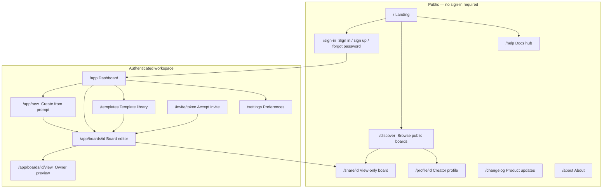

### Create a board — AI generation pipeline

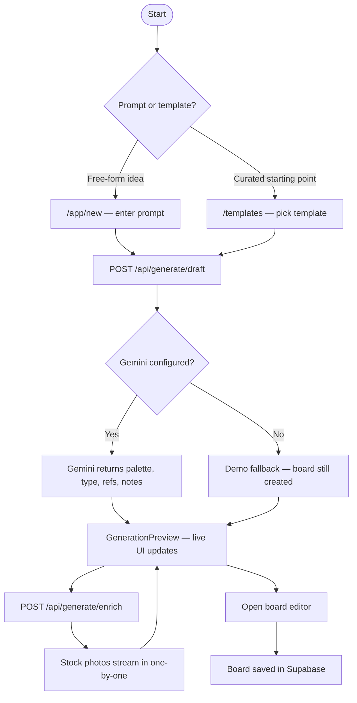

### Board editor — sections & actions

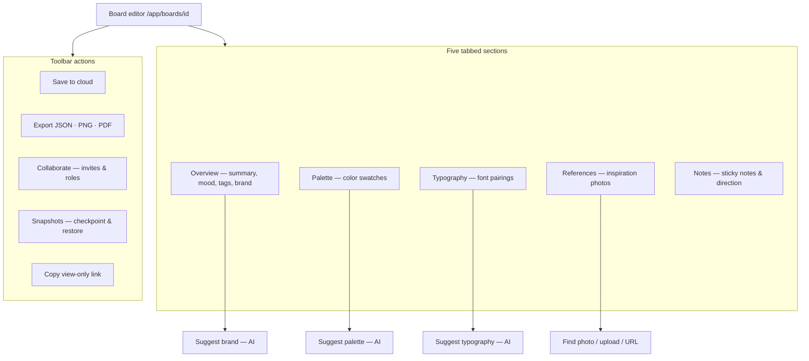

### Sign-in & gated access

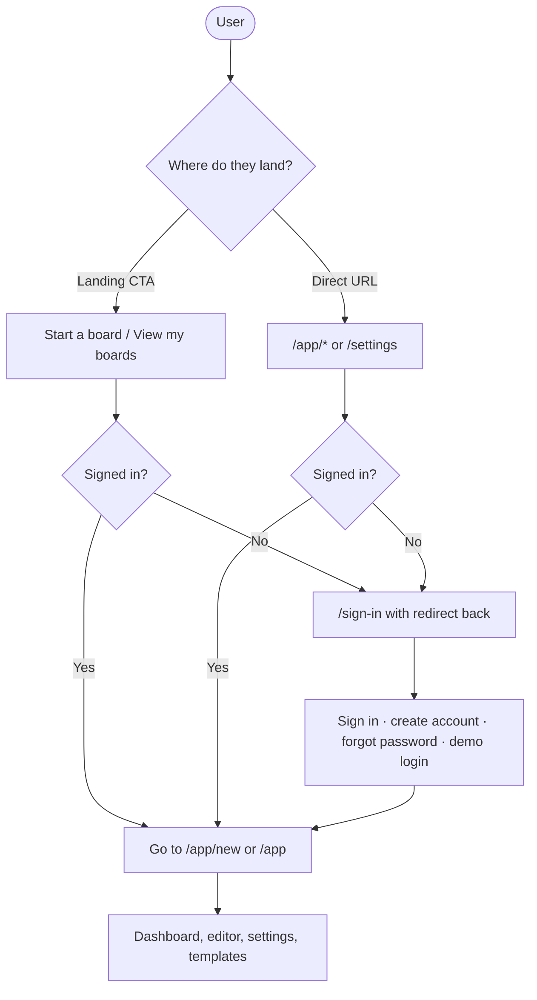

### Collaboration & sharing

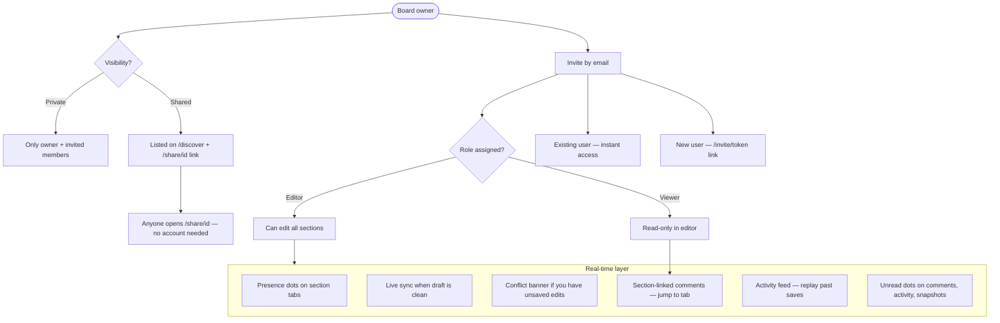

### Export flow

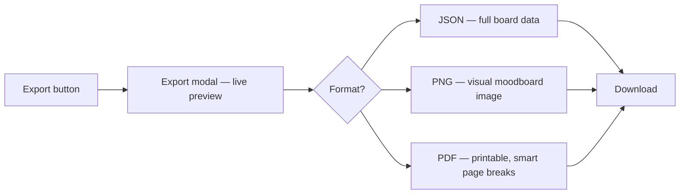

---

## Traditional vs MoodBoard AI

| | Traditional moodboarding | MoodBoard AI |
|---|--------------------------|--------------|
| **Starting point** | Blank canvas or scattered bookmarks | One prompt or template |
| **First draft** | Hours of manual curation | Minutes with AI + live preview |
| **Structure** | Often inconsistent across tools | Fixed sections: palette, type, refs, notes |
| **Collaboration** | Screenshots, Slack threads, Figma comments | Invites, presence, comments, activity replay |
| **Handoff** | Rebuild or screenshot exports | JSON, PNG, or PDF with live preview |
| **Iteration** | Start over or duplicate files | Snapshots, restore, AI re-suggestions |

---

## Who it's for

| Audience | How they use it |
|----------|-----------------|
| **Designers** | Fast first drafts and client-ready exports |
| **Founders & marketers** | Articulate brand direction without a full agency |
| **Brand strategists** | Positioning, voice, and visual language in one board |
| **Creative directors** | Review, comment, and iterate with a team |
| **Content creators** | Consistent look-and-feel references for campaigns |

---

## What you can do

<details open>
<summary><strong>Account</strong></summary>

- Email/password sign-in and sign-up
- **Forgot password** — reset email → update password after `/auth/callback`
- Demo account for portfolio exploration

</details>

<details open>
<summary><strong>Create & edit</strong></summary>

- Generate from a **prompt** or **template** with progressive live preview
- Tabbed editor — Overview, Palette, Typography, References, Notes
- AI **suggest palette, typography, or brand strategy** on demand
- **Snapshots** — save checkpoints with preview-before-restore

</details>

<details open>
<summary><strong>Share & collaborate</strong></summary>

- Email invites with **owner / editor / viewer** roles (copy invite link, or automatic email when Resend is configured)
- **Real-time presence** — colored dots on section tabs show who is on each tab
- **Section-linked comments** — tag feedback to Overview, Palette, Typography, References, or Notes; **View in section** jumps the editor
- **Unread indicators** — yellow dots on new comments, activity, and snapshots (your own posts never count as unread)
- **Activity replay** with section badges and save notifications
- View-only links at `/share/[id]` · public boards on `/discover` · creator profiles at `/profile/[id]`

</details>

<details open>
<summary><strong>Export & organize</strong></summary>

- **JSON**, **PNG**, **PDF**, or **design system** export with live preview
- Dashboard filters — All, With me, With others, Public, Private
- Favorites, duplicate, global search with **`⌘K`**

</details>

→ Full catalog: [docs/FEATURES.md](docs/FEATURES.md)

---

## Try it

### Live app

**[moodboard-ai-omega.vercel.app](https://moodboard-ai-omega.vercel.app)**

Sign in with the demo account (pre-seeded workspace):

| | |
|---|---|
| **Email** | `admin@moodboard.ai` |
| **Password** | `moodboard123` |

Suggested first run: open **New board** → enter a short prompt → watch the live preview → open the editor → try **Export** or **Collaborate**.

### Run locally

```bash
cp .env.local.example .env.local   # Supabase required; Gemini, Resend, and SITE_URL optional
npm install
npm run setup:supabase
npm run verify:generate
npm run dev
```

Open [http://localhost:3000](http://localhost:3000) · Setup guide: [docs/MANUAL_SETUP.md](docs/MANUAL_SETUP.md)

---

## FAQ

<details>
<summary><strong>Do I need an API key to try it?</strong></summary>

The live demo and local app work with Supabase configured. **Gemini** (`GEMINI_API_KEY`) enables real AI generation; without it, a demo fallback still creates boards. Reference photos use optional Pexels/Unsplash keys.

</details>

<details>
<summary><strong>Is my work saved?</strong></summary>

Yes — boards and settings persist per account in Supabase. Sign in to keep your workspace across sessions and devices.

</details>

<details>
<summary><strong>Can I share a board without giving edit access?</strong></summary>

Yes. Set visibility to **Shared** for a view-only link at `/share/[id]`, or invite collaborators with **editor** or **viewer** roles.

</details>

<details>
<summary><strong>What can I export?</strong></summary>

**JSON** (full board data), **PNG** (visual summary), **PDF** (print-ready with smart page breaks), or **design system tokens** (CSS, Tailwind, JSON, Markdown). All formats include palette, typography, references, notes, and brand strategy when saved.

</details>

<details>
<summary><strong>Is this production-ready?</strong></summary>

It's a deployed, **portfolio-complete** MVP with auth, persistence, collaboration, AI generation, and export. Resend and `NEXT_PUBLIC_SITE_URL` are optional — see [docs/DEPLOY.md](docs/DEPLOY.md). Shipped work: [docs/ROADMAP.md](docs/ROADMAP.md).

</details>

---

## For developers

### Tech stack

| Layer | Tools |
|-------|-------|
| **Frontend** | Next.js 16 (App Router), React 19, TypeScript, Tailwind CSS v4 |
| **Backend** | Supabase — Postgres, Auth, Realtime, Storage |
| **AI** | Google Gemini free tier (demo fallback) |
| **Photos** | Pexels + Unsplash · manual URL/upload in editor |
| **Deploy** | Vercel · Analytics |

→ [docs/ARCHITECTURE.md](docs/ARCHITECTURE.md) · [docs/AGENT_HANDOFF.md](docs/AGENT_HANDOFF.md) (agent context)

### Scripts

| Command | Purpose |
|---------|---------|
| `npm run dev` | Start dev server |
| `npm run build` | Production build |
| `npm run setup:supabase` | Verify Supabase + seed demo user |
| `npm run db:seed-demo-boards` | Seed shared demo boards for Discover (requires demo user) |
| `npm run verify:generate` | Test Gemini / mock generation |
| `npm run verify:collaboration` | Test collaboration APIs |
| `npm run verify:prod-smoke` | Automated checks against the live demo deploy |
| `npm run test:smoke` | Alias for `verify:prod-smoke` |
| `npm run capture:screenshots` | Refresh README portfolio screenshots |

**Optional env vars:** Only Supabase keys are required for a full local run. `RESEND_*` enables automatic invite emails; without them, use **Copy invite link** in Collaborate. `NEXT_PUBLIC_SITE_URL` is optional — Vercel injects `VERCEL_URL` in production.

---

## Documentation

### Setup & deploy

| Doc | Description |
|-----|-------------|
| [MANUAL_SETUP.md](docs/MANUAL_SETUP.md) | First-time local setup |
| [SUPABASE_SETUP.md](docs/SUPABASE_SETUP.md) | Database, auth, migrations |
| [GEMINI_SETUP.md](docs/GEMINI_SETUP.md) | AI text generation |
| [REFERENCE_PHOTOS.md](docs/REFERENCE_PHOTOS.md) | Pexels / Unsplash reference images |
| [DEPLOY.md](docs/DEPLOY.md) | Production deploy + smoke tests |

### Project reference

| Doc | Description |
|-----|-------------|
| [ARCHITECTURE.md](docs/ARCHITECTURE.md) | Stack, repo layout, system diagrams |
| [FEATURES.md](docs/FEATURES.md) | Implemented features + page flow |
| [SYSTEMS.md](docs/SYSTEMS.md) | Auth, persistence, AI, export pipelines |
| [DEVELOPMENT.md](docs/DEVELOPMENT.md) | Standards, a11y, theme, known issues |
| [ROADMAP.md](docs/ROADMAP.md) | Shipped work and what's next |
| [AGENT_HANDOFF.md](docs/AGENT_HANDOFF.md) | Notes for AI agents and contributors |

---

## License

Private project. All rights reserved.
