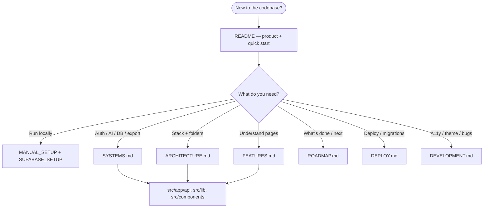

# Agent handoff

Notes for AI agents and contributors continuing development in Cursor or other environments.

Back to [README](../README.md) · Roadmap: [ROADMAP](ROADMAP.md) · Features: [FEATURES](FEATURES.md)

Also read [`AGENTS.md`](../AGENTS.md) for Next.js framework conventions (this project uses Next.js 16 with breaking API differences).

Flow diagrams: [README § App flow](../README.md#app-flow) · [ARCHITECTURE](ARCHITECTURE.md) · [SYSTEMS](SYSTEMS.md) · [FEATURES § Page flow](FEATURES.md#page-flow)

---

## Where to look

| Topic | Document |
|-------|----------|
| Quick start | [README](../README.md) |
| Stack & folders | [ARCHITECTURE](ARCHITECTURE.md) |
| Auth, DB, AI, export | [SYSTEMS](SYSTEMS.md) |
| Page-by-page features | [FEATURES](FEATURES.md) |
| A11y, theme, known issues | [DEVELOPMENT](DEVELOPMENT.md) |
| Shipped vs planned | [ROADMAP](ROADMAP.md) |
| Production deploy | [DEPLOY](DEPLOY.md) |

---

## Important context

- Landing page full redesign was **deferred** (current design preferred).
- Theme **sync** across landing ↔ app is fixed; incremental visual polish remains.
- AI generation uses **Gemini free tier** (`gemini-2.5-flash` → `gemini-2.5-flash-lite` → demo fallback) via **`POST /api/generate/draft` → `POST /api/generate/enrich`**. Set `GEMINI_API_KEY`, `PEXELS_API_KEY`, and `UNSPLASH_ACCESS_KEY` locally and on Vercel.
- **Progressive preview** — [`GenerationPreview`](../src/components/creation/GenerationPreview.tsx) on `/app/new` and `/templates`; templates linger ~4s on completed preview before editor redirect.
- **Template-aware Gemini** — `buildTemplateGenerationPrompt()` sends full template context; no post-generation template overlay on the Gemini path.
- **TopBar theme toggle** — sun/moon control next to search; persists across navigation.
- Boards and settings persist in **Supabase** (per-user, RLS-protected). Sidebar collapse stays in localStorage.
- **Production is deployed** on Vercel — push to `main` triggers redeploy. See [DEPLOY](DEPLOY.md).
- **Authentication** — Supabase Auth with proxy protection. See [SYSTEMS](SYSTEMS.md#database--persistence).
- **View-only sharing** at `/share/[id]` for boards with visibility **Shared** (migration `002`).
- **Discover** at `/discover` — featured row + creator names on cards.
- **Collaboration** — invite by email; dashboard **With me** / **With others** / **Public** / **Private** filters; per-member favorites (migration `019`).
- **Real-time co-editing** — presence dots on section tabs, live board sync, conflict banner (migration `006`). Section metadata: [`editor-sections.ts`](../src/lib/editor-sections.ts).
- **Board comments** — `GET/POST/PATCH/DELETE /api/boards/[id]/comments`; `section` column (migration `022`) links comments to editor tabs.
- **Collaboration unread** — yellow-dot unseen on comments, activity, snapshots; own content excluded ([`collaboration-read-state.ts`](../src/lib/collaboration-read-state.ts)). Snapshots last-read: migration `023`. Mark read explicitly — panels do not auto-clear on open.
- **Board activity + replay** — migrations `008`–`013`; verify with `npm run verify:collaboration`.
- **Collaboration retention** — migration `018`.
- **Reference photos** — [REFERENCE_PHOTOS](REFERENCE_PHOTOS.md).
- **AI suggestions** — typography, palette, brand (`021` for persisted brand strategy).
- **Collaboration notifications** — remote-save toast, unread tab title, toolbar pulse.
- **Snapshot limits** — migration `020`.
- **Visual export** — JSON / PNG / PDF with live preview; brand strategy in visual export. See [SYSTEMS](SYSTEMS.md#visual-board-export).
- **Design system export** — CSS, Tailwind, tokens JSON, Markdown from Export modal; optional AI token naming via `POST /api/generate/design-system`.
- **User profiles** — `/profile/[id]` public creator page; `GET /api/profile/[id]`; Discover creator name links.
- **Design tokens** — [`board-editor-styles.ts`](../src/components/board/board-editor-styles.ts) (editor, presence, dashboard, modals); [`app-surface-styles.ts`](../src/components/shared/app-surface-styles.ts) (landing, discover, templates, settings shells).
- **Changelog** — `/changelog` public product updates; entries in [`changelog-entries.ts`](../src/lib/changelog-entries.ts).
- **Command palette templates** — `⌘K` template search → `/templates?focus=<id>` with scroll highlight.
- **Help** — `/help` docs hub in landing nav + palette.
- **Snapshot mark-seen** — preview or eye button advances `snapshots_last_read_at` via `markSnapshotId` PATCH.
- **Palette AI** — `⌘K` → suggest brand / palette / typography on editor boards.
- **Discover moods** — `/discover` mood filter **dropdown** + `?mood=` URL; logic in [`discover-moods.ts`](../src/lib/discover-moods.ts).
- **Creator display name** — public profiles use `profiles.name`; Settings **Your name** via `PATCH /api/profile/me`; workspace name stays separate.
- **Profile photos** — upload + crop in Settings; migration `024`; `DELETE /api/profile/avatar/upload` removes photo.
- **Share / remix** — creator link on share page; Discover nav active on `/share` and `/profile`; prompt pre-fill on `/app/new?prompt=`.
- **Auth completeness** — forgot password, Google/GitHub OAuth, [`/auth/callback`](../src/app/auth/callback/route.ts).
- **Portfolio metadata** — favicon, default OG image ([`opengraph-image.tsx`](../src/app/opengraph-image.tsx)), route meta for Discover/share/profile ([`site-metadata.ts`](../src/lib/site-metadata.ts)).
- **Comments scrim** — panel backdrop uses `--overlay-scrim` token.
- **Demo boards seed** — `npm run db:seed-demo-boards` (after `db:seed-demo`) populates shared showcase boards.
- **Tooltips** — [`tooltip.tsx`](../src/components/ui/tooltip.tsx) + `Button` `tooltip` prop. Use `triggerClassName="block w-full"` when wrapping full-width grid/card triggers; default wrapper is `inline-flex` (breaks vertical nav lists if parent is not `flex-col`).
- **View mode** — [`BoardReadOnlyClient.tsx`](../src/components/board/BoardReadOnlyClient.tsx): one section heading per tab; no duplicate card titles.
- Board editor loads from Supabase after hydration (no false "not found").
- Settings controls are wired to real behavior (theme, reduce motion, focus rings, default visibility, presentation mode, workspace identity).

---

## When resuming work

Follow [ROADMAP](ROADMAP.md): advanced reference APIs and long-term co-editing polish. Marketplace/pricing/Stripe are **parked**.

Run migrations through **`024`** in production if not applied — see [DEPLOY](DEPLOY.md#step-5d--apply-latest-migrations-022023) and migration `024_avatar_image.sql`.
