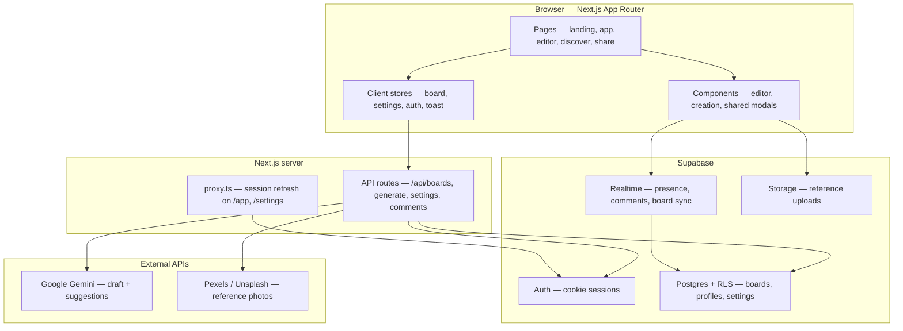
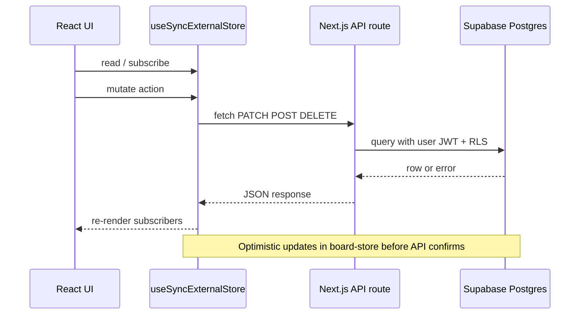
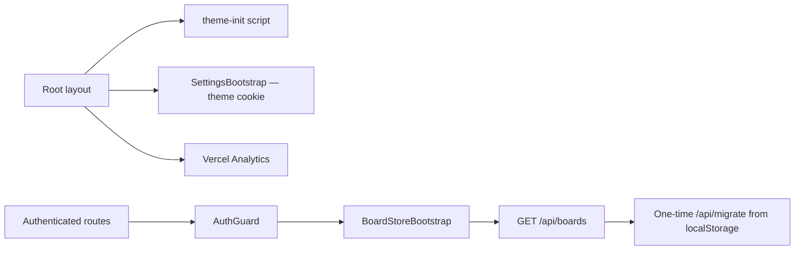

# Architecture

Tech stack, repository layout, and product vision for MoodBoard AI.

Back to [README](../README.md) · See also [FEATURES](FEATURES.md) · [SYSTEMS](SYSTEMS.md)

Diagrams in this doc: [system overview](#system-overview) · User flows: [README § App flow](../README.md#app-flow)

## Product vision

MoodBoard AI helps:

- Designers
- Founders
- Brand strategists
- Creative directors
- Marketing teams
- Content creators

turn rough ideas into structured creative direction.

Instead of manually assembling Pinterest boards, color palettes, references, fonts, and brand systems, users provide a prompt and MoodBoard AI generates:

- Creative direction
- Moodboards
- Color systems
- Typography pairings
- References
- Brand positioning
- Design guidance

The long-term vision is to become:

> **“The Figma + Pinterest + Creative Director powered by AI.”**

The product is meant to feel polished, premium, and app-like, while remaining practical and highly usable.

User-facing route diagrams: [README § App flow](../README.md#app-flow) · Technical subsystem diagrams: [SYSTEMS](SYSTEMS.md)

---

## System overview

High-level view of how the app, API layer, and external services connect.



### Client data flow

How authenticated reads and writes move through the stack.



### App bootstrap

What loads on first paint and after sign-in.



---

### Framework

- Next.js 16 (App Router)
- React
- TypeScript

### Styling

- Tailwind CSS v4
- CSS Variables
- Theme tokens
- Light / dark / system theme support

### UI

- Custom component architecture
- Lucide icons
- Framer Motion (landing-page animations; respects the reduce-motion preference)

### State Management

Current:

- Supabase (boards + per-user settings via API routes)
- Custom stores (hand-rolled with React's `useSyncExternalStore` — see `src/lib/board-store.ts`, `src/lib/settings-store.ts`, `src/lib/auth-store.ts`, `src/components/shared/toast-store.ts`, `src/components/shared/command-palette-store.ts`)
- Device-only UI prefs in localStorage (sidebar collapse)

### Deployment

- Vercel

### Analytics

Implemented:

- Vercel Analytics

---

## Project structure

```txt
src/
├── app/
│   ├── api/           # boards, comments, discover, generate/draft|enrich, profile, migrate, settings, snapshots
│   ├── auth/callback/ # password-reset code exchange
│   ├── page.tsx       # landing
│   ├── layout.tsx     # ThemeSync + SettingsBootstrap
│   ├── (auth)/sign-in/
│   ├── app/           # dashboard, editor, new board
│   ├── discover/
│   ├── profile/[id]/  # public creator profiles (layout.tsx + LandingHeader)
│   ├── settings/
│   ├── share/[id]/    # public view + Open Graph meta
│   ├── templates/
│   ├── help/
│   ├── changelog/
│   └── about/
├── components/
│   ├── auth/          # AuthForm, AuthGuard, use-gated-href
│   ├── landing/
│   ├── layout/        # AppShell, Sidebar, TopBar, BoardStoreBootstrap
│   ├── board/         # BoardEditorClient, BoardExportCapture, BoardSnapshotsPanel, board-editor-styles.ts
│   ├── creation/      # PromptComposer, GenerationPreview, TemplateGenerationPanel
│   └── shared/        # ExportModal, CommandPalette, AppIcon, ThemeToggle, SettingsBootstrap, Toast
├── lib/
│   ├── ai-generate.ts
│   ├── ai.ts          # runProgressiveBoardGeneration, streamEnrichedBoard
│   ├── auth-store.ts
│   ├── board-store.ts
│   ├── export-capture.ts
│   ├── export-pdf.ts
│   ├── retention-duration.ts
│   ├── settings-store.ts
│   └── supabase/
docs/                  # setup, deploy, ARCHITECTURE, FEATURES, SYSTEMS, ROADMAP, etc.
scripts/               # setup:supabase, verify:generate, seed-demo, seed-demo-boards
supabase/migrations/   # 001–024 (collaboration, snapshots, retention, brand strategy, section comments, avatars)
```
