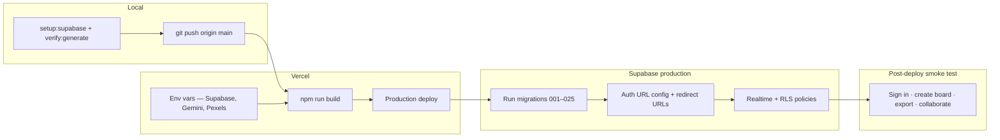

# Deploy MoodBoard AI to Vercel

## Prerequisites

- Local smoke test passed (`npm run setup:supabase`, `npm run verify:generate`)
- GitHub repo connected to Vercel (or use Vercel CLI)
- Supabase project running

## Deploy pipeline



---

## Step 1 — Push to GitHub

```bash
git push origin main
```

## Step 2 — Create Vercel project

1. Go to [vercel.com/new](https://vercel.com/new) and import the repository.
2. Framework preset: **Next.js** (auto-detected).
3. Build command: `npm run build` (default).
4. Output directory: `.next` (default).

## Step 3 — Environment variables

In Vercel → **Settings** → **Environment Variables**, add:

| Variable | Value |
|----------|-------|
| `NEXT_PUBLIC_SUPABASE_URL` | From Supabase → Project Settings → API |
| `NEXT_PUBLIC_SUPABASE_ANON_KEY` | Supabase `anon` public key |
| `SUPABASE_SERVICE_ROLE_KEY` | Supabase `service_role` secret key |
| `GEMINI_API_KEY` | Optional — enables free-tier Gemini AI (see [`docs/GEMINI_SETUP.md`](GEMINI_SETUP.md)) |
| `PEXELS_API_KEY` | Optional — primary reference photo search (see [`docs/REFERENCE_PHOTOS.md`](REFERENCE_PHOTOS.md)) |
| `UNSPLASH_ACCESS_KEY` | Optional — fallback reference photo search (see [`docs/REFERENCE_PHOTOS.md`](REFERENCE_PHOTOS.md)) |

Apply to **Production**, **Preview**, and **Development**.

## Step 4 — Configure Supabase for production

In Supabase → **Authentication** → **URL Configuration**:

1. Set **Site URL** to your Vercel domain (e.g. `https://moodboard-ai-omega.vercel.app`).
2. Add redirect URLs:
   - `https://your-domain.vercel.app/**`
   - `https://your-domain.vercel.app/auth/callback` (required for password reset)
   - `https://your-domain.vercel.app/sign-in`

## Step 5 — Deploy

Trigger a deploy from the Vercel dashboard or:

```bash
npx vercel --prod
```

## Step 5b — Run collaboration migrations (production Supabase)

After deploying collaboration features, run these in the **production** Supabase SQL Editor (in order):

1. [`supabase/migrations/006_board_realtime_comments.sql`](../supabase/migrations/006_board_realtime_comments.sql) — Realtime on `boards`, `board_comments` table, live comment sync
2. [`supabase/migrations/007_collaboration_polish.sql`](../supabase/migrations/007_collaboration_polish.sql) — `last_saved_by_name` on boards, `author_name` on comments (conflict banner + live comment attribution)
3. [`supabase/migrations/008_board_activity.sql`](../supabase/migrations/008_board_activity.sql) — `board_activity` table + Realtime for the Activity panel (live save history)
4. [`supabase/migrations/009_board_activity_changes.sql`](../supabase/migrations/009_board_activity_changes.sql) — structured `changes` JSON on activity rows (detailed summaries + replay)
5. [`supabase/migrations/010_collaboration_hygiene.sql`](../supabase/migrations/010_collaboration_hygiene.sql) — read/unread state + activity delete policy
6. [`supabase/migrations/011_user_settings_retention.sql`](../supabase/migrations/011_user_settings_retention.sql) — collaboration retention settings (hide + owner purge)
7. [`supabase/migrations/012_collaboration_item_state.sql`](../supabase/migrations/012_collaboration_item_state.sql) — per-item read/hide overrides + owner-only comment delete
8. [`supabase/migrations/013_activity_owner_delete.sql`](../supabase/migrations/013_activity_owner_delete.sql) — owner-only activity delete (non-owners use Hide)
9. [`supabase/migrations/014_reference_uploads_storage.sql`](../supabase/migrations/014_reference_uploads_storage.sql) — public `reference-uploads` bucket for manual reference image uploads
10. [`supabase/migrations/015_board_snapshots.sql`](../supabase/migrations/015_board_snapshots.sql) — `board_snapshots` table for manual save and restore
11. [`supabase/migrations/016_board_realtime_presence.sql`](../supabase/migrations/016_board_realtime_presence.sql) — RLS on `realtime.messages` for board presence channels (required when Realtime **Allow public access** is disabled)
12. [`supabase/migrations/017_board_snapshots_owner_delete.sql`](../supabase/migrations/017_board_snapshots_owner_delete.sql) — owner-only delete policy on `board_snapshots`
13. [`supabase/migrations/018_user_settings_retention_duration.sql`](../supabase/migrations/018_user_settings_retention_duration.sql) — flexible collaboration retention (`collaboration_retention` JSON with amount + unit)
14. [`supabase/migrations/019_board_member_favorites.sql`](../supabase/migrations/019_board_member_favorites.sql) — per-member favorite state on `board_members` for collaborator dashboards
15. [`supabase/migrations/020_user_settings_snapshot_limits.sql`](../supabase/migrations/020_user_settings_snapshot_limits.sql) — owner snapshot cap + auto-prune preferences on `user_settings`
16. [`supabase/migrations/021_board_brand_strategy.sql`](../supabase/migrations/021_board_brand_strategy.sql) — optional `brand_strategy` JSON on `boards` for saved AI brand suggestions
17. [`supabase/migrations/022_board_comment_section.sql`](../supabase/migrations/022_board_comment_section.sql) — `section` on `board_comments` (overview, palette, typography, references, notes)
18. [`supabase/migrations/023_snapshots_last_read.sql`](../supabase/migrations/023_snapshots_last_read.sql) — `snapshots_last_read_at` on `board_collaboration_state` for unread snapshot badges
19. [`supabase/migrations/024_avatar_image.sql`](../supabase/migrations/024_avatar_image.sql) — `user_settings.avatar_image_url` + `avatar-uploads` storage bucket for profile photos

If collaboration was already live, confirm migrations `004` and `005` are applied before `006`.

## Step 5c — Apply latest migrations (020–021)

If production was deployed before snapshot limits or brand strategy shipped, run these in the **production** Supabase SQL Editor (in order):

1. [`supabase/migrations/020_user_settings_snapshot_limits.sql`](../supabase/migrations/020_user_settings_snapshot_limits.sql)
2. [`supabase/migrations/021_board_brand_strategy.sql`](../supabase/migrations/021_board_brand_strategy.sql)

Verify columns exist:

```sql
select column_name
from information_schema.columns
where table_schema = 'public'
  and table_name = 'user_settings'
  and column_name in ('snapshot_max_per_board', 'snapshot_auto_prune');

select column_name
from information_schema.columns
where table_schema = 'public'
  and table_name = 'boards'
  and column_name = 'brand_strategy';
```

Expected: one row per column. Re-deploy Vercel after applying if the app was already live.

## Step 5d — Apply latest migrations (022–023)

If production was deployed before section-linked comments or snapshot unread badges shipped, run these in the **production** Supabase SQL Editor (in order):

1. [`supabase/migrations/022_board_comment_section.sql`](../supabase/migrations/022_board_comment_section.sql)
2. [`supabase/migrations/023_snapshots_last_read.sql`](../supabase/migrations/023_snapshots_last_read.sql)

Verify columns exist:

```sql
select column_name
from information_schema.columns
where table_schema = 'public'
  and table_name = 'board_comments'
  and column_name = 'section';

select column_name
from information_schema.columns
where table_schema = 'public'
  and table_name = 'board_collaboration_state'
  and column_name = 'snapshots_last_read_at';
```

Expected: one row per column. Re-deploy Vercel after applying if the app was already live.

## Step 5e — Apply latest migration (024)

If production was deployed before profile photo upload shipped, run this in the **production** Supabase SQL Editor:

1. [`supabase/migrations/024_avatar_image.sql`](../supabase/migrations/024_avatar_image.sql)

Verify column and bucket exist:

```sql
select column_name
from information_schema.columns
where table_schema = 'public'
  and table_name = 'user_settings'
  and column_name = 'avatar_image_url';
```

Expected: one row. Confirm **Storage** includes the `avatar-uploads` bucket. Re-deploy Vercel after applying if the app was already live.

## Step 5f — Apply latest migration (025)

If production was deployed before board auto-save settings shipped, run this in the **production** Supabase SQL Editor:

1. [`supabase/migrations/025_autosave_interval.sql`](../supabase/migrations/025_autosave_interval.sql)

Verify column exists:

```sql
select column_name
from information_schema.columns
where table_schema = 'public'
  and table_name = 'user_settings'
  and column_name = 'autosave_interval';
```

Expected: one row. Re-deploy Vercel after applying if the app was already live.

> **Presence:** By default the app uses a public Realtime presence channel so collaborators show up without extra setup. If you disable **Allow public access** under Supabase **Project Settings → Realtime**, run migration `016` and set `NEXT_PUBLIC_SUPABASE_REALTIME_PRIVATE=true` in Vercel.

> `alter publication supabase_realtime add table` is not idempotent. If `006` was partially applied, check **Database → Publications → supabase_realtime** before re-running.

## Step 6 — Smoke test production

Before manual testing, verify the connected Supabase project locally:

```bash
npm run verify:collaboration
```

Confirm **Production** env vars on Vercel: `NEXT_PUBLIC_SUPABASE_URL`, `NEXT_PUBLIC_SUPABASE_ANON_KEY`, `SUPABASE_SERVICE_ROLE_KEY`, optional `GEMINI_API_KEY` (text generation), optional `PEXELS_API_KEY` and `UNSPLASH_ACCESS_KEY` (reference photos).

| Test | Expected |
|------|----------|
| Visit `/` | Landing page loads |
| Visit `/app` logged out | Redirect to `/sign-in` |
| Sign in | Dashboard loads |
| Sign-in → **Forgot password?** | Reset email sent; link opens update-password flow via `/auth/callback` |
| Create board from `/app/new` | Progressive preview visible during generation; board persists after refresh |
| Create board from `/templates` | Inline preview on active card; ~4s pause then redirect to editor |
| TopBar theme toggle | Sun/moon control next to search; theme persists across navigation |
| Settings change | Persists after sign-out/in |
| Open board → **Comments** | Panel opens; post succeeds |
| Open board → **Activity** | Panel opens; save events appear in real time |
| Board sidebar | Shows **Last saved by** after a save (requires migration 007) |
| Two browsers on same board (owner + invited editor) | Presence avatars appear for both |
| Save in browser A (B has no unsaved edits) | Browser B updates without refresh |
| Save in browser A while B has unsaved edits | B shows conflict banner with saver name (Reload / Keep editing) |
| Viewer opens shared board | Inputs read-only; comments still work |
| User A posts comment | User B sees A's name via realtime (not "Collaborator") |
| Comments / Activity unread badges | New items show unread styling; Eye/EyeOff toggles per item; opening panel marks all read |
| Per-item hide / Hidden filter | Hide removes item from your view only; restore from Hidden filter |
| Owner comment/activity delete | Trash visible only for owners; non-owners use Hide; app confirmation modal |
| Settings → Collaboration | Hide/purge retention with minutes/hours/days/weeks (migration 018) |
| Settings → Collaboration → Snapshots | Max snapshots per board + auto-prune toggle (migration 020) |
| Settings → Editor | Auto-save interval Off / 5s / 8s / 10s (migration 025) |
| Board editor | Edits auto-save after idle debounce; manual Save changes + confirmation modal unchanged |
| Board editor → Overview → **Suggest brand** | Strategy block appears; Save persists; refresh keeps content (migration 021) |
| Board editor → **Snapshots** with cap = 10, auto-prune on | Saving 11th snapshot prunes oldest; panel shows `X of 10` |
| Two browsers — clean draft + remote save | Browser B shows toast (not conflict banner) |
| Unread comments with panels closed | Tab title `(N)` prefix; toolbar badges pulse |
| Reference editor → **Find photo** | Pexels or Unsplash photo (or demo placeholder); source badge shows correctly |
| Reference editor → **Apply URL** | Custom `https://` image applied and persists after save |
| Reference editor → **Upload file** | Image stored in Supabase; persists after save (requires migration 014) |
| Board editor → **Suggest typography** | Typography rows update (Gemini or demo fallback) |
| Board editor → Export → **Download PNG** | PNG moodboard downloads with palette, typography, references |
| Board editor → Export → **Download PDF** | PDF moodboard downloads scaled to A4 |
| Board editor → **Suggest palette** | Palette rows update (Gemini or demo fallback) |
| Board editor → **Snapshots** → Save / Restore / Preview | Snapshot persists; preview before restore; restore replaces board and logs activity (migrations 015–017) |
| Two browsers on same board — section presence | Collaborator section shown in presence strip, section bar, and section highlight |
| Comment author → Edit | Inline edit saves; shows “(edited)”; syncs via Realtime UPDATE |
| `PATCH /api/boards/[id]/comments/[commentId]` without auth | 401 Unauthorized |

## Troubleshooting

**401 on API routes** — Env vars missing or not redeployed after adding them.

**Auth redirect loop** — Supabase Site URL / Redirect URLs don't match your Vercel domain.

**Password reset link invalid** — Add `https://your-domain.vercel.app/auth/callback` to Supabase redirect URLs; Site URL must match production (not `localhost.com`). Request a fresh reset email and complete the flow in the same browser.

**Demo generation only** — `GEMINI_API_KEY` not set in Vercel (mock fallback is intentional).

**Pexels photos missing** — `PEXELS_API_KEY` not set; Unsplash may still apply if `UNSPLASH_ACCESS_KEY` is set. Otherwise references use SVG demo placeholders.

**Reference upload fails** — Run migration `014_reference_uploads_storage.sql` and confirm `SUPABASE_SERVICE_ROLE_KEY` on Vercel.

## Portfolio demo script (~3 min)

Use this flow when recording or walking through the project:

1. **Landing** — Open `/`, note gated CTAs; sign in with demo account (`admin@moodboard.ai` / `moodboard123`).
2. **Create board** — Go to `/app/new`, enter a prompt, click **Generate board**. Point out progressive preview and **Powered by Gemini** badge (or demo fallback).
3. **References** — Open the new board; show Pexels/Unsplash photos on reference cards. Edit a reference → **Find photo** → **Apply URL** or **Upload file**.
4. **Collaboration** — Set board visibility to **Shared**; open **Collaborate** modal. In a second browser (or incognito), accept invite or open `/share/[id]`.
5. **Realtime** — Save in one browser; show presence avatars, live sync, or conflict banner in the other.
6. **Activity** — Open **Activity** panel; save a change; replay a prior save. Show read/hide badges.
7. **Discover** — Visit `/discover`; use mood filter dropdown; open a creator profile at `/profile/[id]`.

**Env checklist for demos:** Supabase (required) · Gemini (AI text) · Pexels + Unsplash (stock photos) · Vercel deploy on `main`.

---

## Related documentation

| Doc | Description |
|-----|-------------|
| [ARCHITECTURE.md](ARCHITECTURE.md) | Stack and repo layout |
| [ROADMAP.md](ROADMAP.md) | Shipped features and next priorities |
| [AGENT_HANDOFF.md](AGENT_HANDOFF.md) | Notes for AI agents / contributors |
