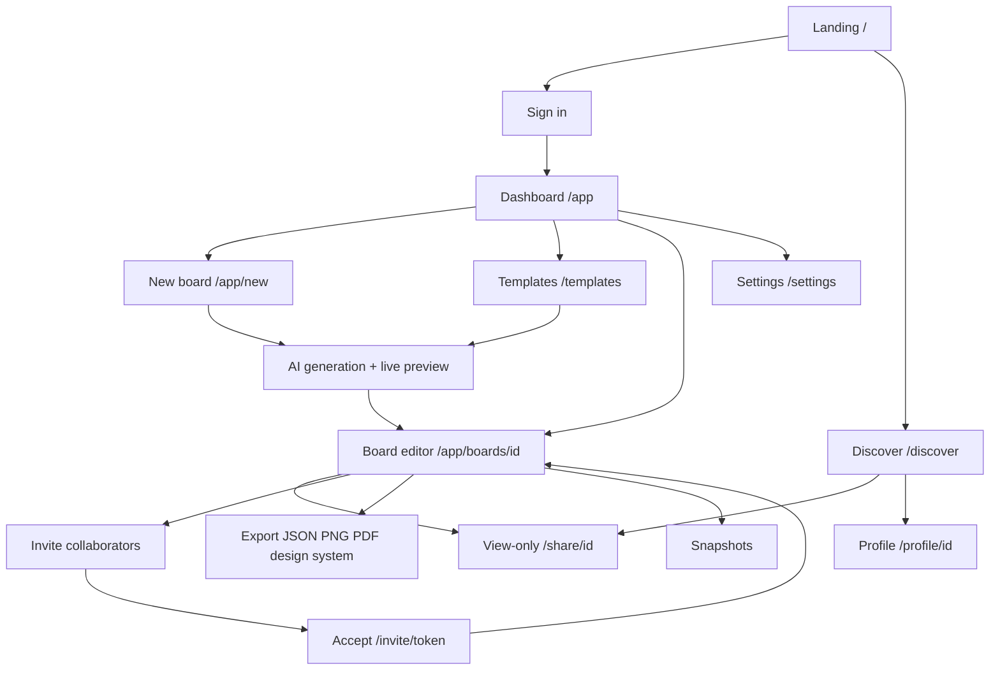

# Features

Implemented product features by page and module.

Back to [README](../README.md) · Subsystems: [SYSTEMS](SYSTEMS.md) · Roadmap: [ROADMAP](ROADMAP.md)

User-facing flow diagrams: [README § App flow](../README.md#app-flow)

## Page flow

How users move between major surfaces. See [SYSTEMS](SYSTEMS.md) for API and persistence detail.



---

### Landing Page

The landing page is implemented and includes:

#### Hero Section

- Product headline
- AI creative workspace positioning
- CTA buttons
- Example creative direction preview

#### Feature Grid

Feature highlights include:

- AI Creative Direction
- Curated Palettes
- Typography Pairing
- Composable Boards

#### Example Board Preview

Displays:

- Tags
- Palette
- Typography
- Direction

#### CTA Section

A conversion-focused call to action.

---

### Sign in

Route:

```txt
/sign-in
```

Implemented:

- Email + password sign-in and sign-up tabs (in-page toggle; `/sign-in?mode=sign-up` for create account)
- **Forgot password** — link on sign-in; email reset via `requestPasswordReset`; Supabase redirects to `/auth/callback?next=/sign-in?mode=update-password`; user sets a new password on the update-password screen
- Password show/hide toggle on password fields
- Demo account shortcut for portfolio exploration
- Redirect-back to protected routes after auth (`?redirect=` sanitized to internal paths)
- Inline validation, error banners, loading states, and toast feedback

Auth callback:

```txt
/auth/callback   # Password-reset code exchange (exchangeCodeForSession)
```

---

### Dashboard

Route:

```txt
/app
```

Implemented:

#### Board Grid

Displays saved boards.

#### Board Cards

Includes:

- Board title
- Favorite state (owners and collaborators — per-member favorites via migration `019`)
- Metadata
- Visibility indicator (Private / Public) and **Collaborators** badge when shared outward
- Quick actions

#### Visibility & Filtering

Four independent dimensions — do not conflate collaborator access with Discover visibility:

| Filter | URL param | Meaning |
|--------|-----------|---------|
| **All boards** | _(none)_ | Everything you own or collaborate on |
| **With me** | `visibility=collaborating` | Incoming — boards where you are editor/viewer |
| **With others** | `visibility=with-others` | Outgoing — owned boards with members or pending invites |
| **Public** | `visibility=shared` | Your owned boards listed on Discover |
| **Private** | `visibility=private` | Your owned boards not on Discover |

- **`hasCollaborators`** on owned boards comes from `GET /api/boards` (batch `board_members` + pending `board_invites` counts).
- **With me** access sub-filter: Any / Can edit / View only.
- Sort by Recent or Favorites; filter state persists in the URL.
- Click an active visibility filter again to toggle back to **All boards**; **Reset filters** and empty-state **Clear filters** clear visibility and access params.
- [`CollaborateModal`](../src/components/shared/CollaborateModal.tsx) calls `reloadBoards()` after invite/member changes so filters stay fresh.

#### Empty States

Implemented.

#### Loading States

Implemented.

#### Accessibility

Implemented.

---

### App Shell

Implemented across authenticated routes (`/app`, `/settings`, `/templates`, board editor):

- **Sidebar** — navigation, workspace avatar, collapse state in `localStorage`; collapsed mode shows icon-only nav with tooltips and a bottom-aligned expand control
- **TopBar** — brand link, search / `⌘K` command palette trigger, **sun/moon theme toggle** ([`ThemeToggle`](../src/components/shared/ThemeToggle.tsx)), account menu
- **Tooltips** — frosted custom tooltips ([`tooltip.tsx`](../src/components/ui/tooltip.tsx)) on icon-only controls; supplementary hints use a longer delay when visible labels exist
- **Surface tokens** — shared shells, cards, buttons, and preview tiles via [`app-surface-styles.ts`](../src/components/shared/app-surface-styles.ts)
- Theme choice persists via settings cookie + `SettingsBootstrap`

---

### Board Creation Flow

Route:

```txt
/app/new
```

Implemented:

#### Prompt Composer

Users can:

- Enter a prompt (or pick a suggestion)
- Generate a board via staged `POST /api/generate/draft` → `POST /api/generate/enrich` (Gemini or demo fallback)
- Watch a **live progressive preview** ([`GenerationPreview`](../src/components/creation/GenerationPreview.tsx)) as the draft arrives and Pexels references fill in one-by-one
- See **Powered by Gemini** when `GEMINI_API_KEY` is configured
- Redirect to the board editor shortly after generation completes (~650ms)

---

### Board Editor

Route:

```txt
/app/boards/[id]
```

Implemented:

#### Editable Board

Supports:

- Notes
- References
- Board sections

#### Card Components

Implemented:

- Sticky notes
- Reference cards
- Text/content blocks

#### Tabbed sections

Overview, Palette, Typography, References, and Notes — jump via editor tabs or command palette (`⌘K`).

#### AI suggestions

- **Suggest palette** — `POST /api/generate/palette`
- **Suggest typography** — `POST /api/generate/typography`
- **Suggest brand** — `POST /api/generate/brand` on Overview; persisted on board as `brandStrategy` (migration `021`)

#### Save & auto-save

- **Manual save** — **Save changes** opens an **Apply these changes?** confirmation modal; success shows a toast
- **Auto-save** — debounced save after idle edits (default **8 seconds**); success and error toasts (**Changes auto-saved.** / **Auto-save failed.**) when enabled in Settings → Notifications
- Toolbar status: **Unsaved changes** | **Saving…** | **Saved** | **Save failed**; manual Save disabled while saving
- Auto-save pauses when a collaboration conflict banner is showing (`pendingRemoteBoard`) or in replay/viewer mode
- **Settings → Editor** — auto-save interval **Off** / **5s** / **8s** / **10s** (migration `025`)
- Auto-save PATCH requests skip Activity panel entries; manual saves record full activity

#### Actions

Implemented:

- **Collaborate** (public link + people management — owner only; toolbar + ⌘K command palette)
- Export (JSON, PNG, PDF, design system — with live preview)
- Duplicate
- **Save as template** (owner) — publish to Community or save privately via [`SaveTemplateModal`](../src/components/board/SaveTemplateModal.tsx)
- Snapshots (save, preview, restore, auto-backup before restore; cap + auto-prune via migration `020`)

#### Team collaboration

Routes & APIs:

```txt
/invite/[token]                    # Accept email invite (sign-in required)
POST /api/boards/[id]/members      # Invite by email (owner)
GET  /api/boards/[id]/members      # List collaborators
DELETE /api/boards/[id]/members/[userId]
GET  /api/boards/[id]/invites      # Pending invites
POST /api/invites/[token]/accept   # Accept invite
POST /api/boards/[id]/favorite     # Per-member favorite (migration 019)
```

- **Roles** — owner, editor (can edit), viewer (read-only)
- **Email invites** — existing users get access immediately; new users use `/invite/[token]`
- Requires migration `003_board_collaboration.sql`

**Real-time co-editing** (migration `006`):

- Supabase Realtime presence on `board:{id}` — avatars + online count in header; connecting / live / offline states in [`BoardPresenceStrip`](../src/components/board/BoardPresenceStrip.tsx)
- **Section presence** — colored dots on section tabs match each collaborator’s avatar color ([`EditorTabPill`](../src/components/board/BoardEditorClient.tsx)); shared section metadata lives in [`editor-sections.ts`](../src/lib/editor-sections.ts)
- Switching tabs scrolls the tab bar below the app top bar so tabs stay visible
- Live board sync via `postgres_changes` on `boards` when local draft is clean
- Conflict banner on unsaved local edits when a collaborator saves — **Reload** or **Keep editing**
- **Live field sync** — debounced broadcast patches for creative summary and note text ([`use-board-field-sync.ts`](../src/lib/realtime/use-board-field-sync.ts)); [`CollaboratorFieldHighlight`](../src/components/board/CollaboratorFieldHighlight.tsx) shows who is editing each field; active field id in presence

**Board comments** (migration `022` adds `section`):

```txt
GET    /api/boards/[id]/comments
POST   /api/boards/[id]/comments
PATCH  /api/boards/[id]/comments/[commentId]
DELETE /api/boards/[id]/comments/[commentId]
```

- Slide-over comments panel (owner, editor, viewer)
- Comments store the active editor section (`overview`, `palette`, `typography`, `references`, `notes`) with section badges in the thread
- **View in {section}** jumps the editor to that tab and briefly highlights the section content
- Composer shows which section you are commenting from
- Live sync via Realtime on `board_comments` (INSERT, UPDATE, DELETE)
- Authors edit own comments; owners edit or delete any comment

**Unread / unseen collaboration items:**

- Yellow dot + **Unseen** tooltip on unread comments, activity entries, and snapshots ([`CollaborationUnseenIndicator`](../src/components/board/CollaborationUnseenIndicator.tsx))
- Your own comments, activity, and snapshots never count as unread ([`collaboration-read-state.ts`](../src/lib/collaboration-read-state.ts))
- Items stay unseen until explicitly marked — eye/read button, **Preview**, **View in {section}**, **Show on board**, or **Mark all as seen** (panels do not auto-mark on open)
- Toolbar badges on Comments, Activity, and Snapshots buttons; tab title unread count when applicable

**Activity + replay** (migrations `008`–`013`):

- Activity panel with structured change replay, read/hide, owner-only delete
- Activity entries show section badge(s) for the editor tab(s) that changed; **Tags** popover in the panel header lists updated sections
- **Show on board** marks activity read and jumps to the relevant section
- Collaboration retention settings in Settings (migration `018`)
- Verify with `npm run verify:collaboration`

**Snapshots unread** (migration `023`):

- `snapshots_last_read_at` on `board_collaboration_state` per user
- New snapshots from collaborators show an unread dot until marked seen
- Snapshot count in the panel header updates immediately after delete

**Notifications:**

- Remote-save toast when local draft is clean (toggle in Settings → Notifications, migration `026`)
- Auto-save success toast after server confirms (toggle in Settings → Notifications)
- Unread count in tab title + pulsing toolbar badges on Comments / Activity / Snapshots

Planned: live cursors and character-level sync in a single field (field sync is the foundation).

---

### Board View Mode

Routes:

```txt
/app/boards/[id]/view   # Owner preview (authenticated)
/share/[id]             # Public view-only link (no sign-in required)
```

Implemented:

#### Read-Only Board

Supports:

- Presentation mode
- Public view-only sharing at `/share/[id]` when board visibility is **Shared** (migration `002_shared_board_public_read.sql`)
- **Open Graph meta** on share links for richer social previews
- Owner preview at `/app/boards/[id]/view`
- Non-editable consumption
- **Single section heading** per tab — outer section label + description only (no duplicate card titles inside content panels)

---

### Discover Page

Route:

```txt
/discover
```

Implemented:

- Browse all **shared** boards without sign-in
- Search by title, mood, tags, tone, and summary
- **Mood filter dropdown** — mood selector derived from public boards; composes with search; shareable via `?mood=`
- **Featured row** — curated highlight strip at the top (when not searching or filtering by mood)
- **Creator attribution** — creator name on cards via `profiles` join; links to `/profile/[id]`
- Cards link to `/share/[id]` view-only presentation
- `GET /api/discover` — public list of shared boards (newest first, up to 48)
- Demo showcase: `npm run db:seed-demo-boards` seeds 8 shared boards from template presets on the demo account

---

### Profile Page

Route:

```txt
/profile/[id]
```

Implemented:

- Public creator profile (no sign-in required)
- Shared **landing header** shell via [`profile/layout.tsx`](../src/app/profile/layout.tsx) (Discover nav, theme toggle, sign-in CTAs)
- **Display name** from `profiles.name` (Settings **Your name**); workspace name/tagline remain separate branding fields
- Workspace tagline and avatar from `user_settings` (falls back to profile name + defaults)
- Custom **profile photo** upload with crop (migration `024`); remove photo via red **X** on avatar tile in Settings
- Grid of **shared** boards by that creator (reuses Discover card component)
- `GET /api/profile/[id]` — profile identity + shared boards (admin client; email not exposed)

---

### Templates Page

Route:

```txt
/templates
```

Implemented:

#### Template Library

Current functionality:

- Responsive template grid with softened, palette-tinted cards
- **Curated** and **Community** tabs — community templates load from `GET /api/templates`
- Detailed **preview modal** (palette, typography rendered in the actual typefaces, references)
- **Tag filter dropdown** with selected tags shown as removable pills, an "All" option, and a reset action
- **Live tags** — tags added while creating/editing boards automatically appear as filter options
- Static template card imagery from Unsplash URLs (generated boards enrich references via Pexels)

#### Template generation UX

**Use template** runs the draft → enrich pipeline as prompt creation. **Curated** templates call `POST /api/generate/draft` with full template context via `buildTemplateGenerationPrompt()` in [`src/lib/ai-generate.ts`](../src/lib/ai-generate.ts). **Community** templates use [`templateToBoard()`](../src/lib/board-to-template.ts) then the enrich pipeline (no AI draft regeneration).

Board owners can **Save as template** from the editor More menu ([`SaveTemplateModal`](../src/components/board/SaveTemplateModal.tsx)) — private library or publish to Community via `POST /api/templates`.

During creation:

- **Focused grid view** — only the active template card stays visible; others hide
- **Gemini gradient button** ([`TemplateUseTemplateButton`](../src/components/creation/TemplateUseTemplateButton.tsx)) while generating
- **Inline preview** below the active card ([`TemplateGenerationPanel`](../src/components/creation/TemplateGenerationPanel.tsx) + `GenerationPreview`); modal path shows the same preview inside the modal
- **~4s pause** on the completed preview before redirect to the editor

Community templates are stored in `board_templates` (Supabase) and listed on the Community tab when `is_public`.

Planned:

- Real template marketplace (payments, moderation)

---

### Settings Page

Route:

```txt
/settings
```

Implemented (all controls are wired to real behavior — no decorative toggles):

#### Profile / Workspace Identity

- Editable workspace **name** and **tagline**
- Editable **display name** (`profiles.name`) — shown on public profile and account menu; synced via `PATCH /api/profile/me`
- **Avatar** picker with curated emoji avatars grouped into **People** (Artist, Painter, Designer, Creator, Curator) and **Symbols** (Palette, Brush, Pencil, Camera, Film, Sparkle, Star, Moon, Idea), plus **initials** and **custom photo** (upload + crop)
- **Remove profile photo** — red **X** overlay on the avatar tile clears the custom image and reverts to the default emoji avatar
- **Avatar accent** picker (pastel palette) inside the avatar panel
- The chosen identity renders consistently in the **sidebar** and the **top-right avatar** via a shared `WorkspaceAvatar` component

#### Theme Preferences

- System
- Light
- Dark

#### Accessibility

- Keyboard shortcuts (gates the `⌘/Ctrl + K` command palette)
- Reduce motion (applied **app-wide** via a root class)
- Strong focus rings (applied **app-wide** via a root class)
- Keyboard shortcuts reference card (dimmed when shortcuts are disabled)

#### Visibility Defaults

- Private / Shared — actually applied to newly created boards

#### Presentation Mode

User-configurable toggle that gates the keyboard-driven slideshow on the share/view page. When enabled, section tabs show **progress dots** and an **n / 5** counter; header chrome is simplified to title + summary.

#### Notifications

- **Auto-save toasts** — show/hide **Changes auto-saved.** after background saves
- **Remote save toasts** — show/hide collaborator save notifications
- Migration `026_notification_prefs.sql`

#### Collaboration retention

- Hide comments / activity after a configurable **amount + unit** (minutes, hours, days, weeks, or never)
- Owner purge limits for permanently deleting old comments and activity on owned boards
- Migration `018_user_settings_retention_duration.sql`; legacy day-only values map on read via [`retention-duration.ts`](../src/lib/retention-duration.ts)

#### Data Tools

- Import boards (JSON)
- Export boards (JSON backup, PNG moodboard, PDF printable summary, or design system tokens)
- **Reset preferences** (restores settings to defaults, keeps boards)
- **Danger zone** reset (deletes all boards and restores defaults)
- Cloud sync status indicator

---

### Help Page

Route:

```txt
/help
```

Implemented:

- FAQ accordion with getting started, boards/AI, collaboration, export, discover, settings
- In-app deep links and GitHub issues support link
- Static content in [`help-sections.ts`](../src/lib/help-sections.ts)

---

### Changelog Page

Route:

```txt
/changelog
```

Implemented:

- Public product updates page with shipped sprint entries ([`changelog-entries.ts`](../src/lib/changelog-entries.ts))
- Linked from landing header alongside Discover and About
- Uses shared [`app-surface-styles.ts`](../src/components/shared/app-surface-styles.ts)

---

### Command Palette

Implemented.

Shortcut:

```txt
⌘ + K
```

Current capabilities:

- Fuzzy board search by title, summary, prompt, tags, and tone
- Navigation (dashboard, new board, templates, discover, help, settings)
- Board actions (duplicate, favorite toggle)
- **Editor context** (on `/app/boards/[id]`) — jump to Overview, Palette, Typography, References, Notes
- **Editor quick actions** — Export, Snapshots, Share/Collaborate
- **Template navigation** — search by template name, tag, or `template`; opens `/templates?focus=<id>` with scroll highlight
- **AI commands** (editor only) — suggest brand strategy, palette, typography via `dispatchEditorQuickAction`

---
