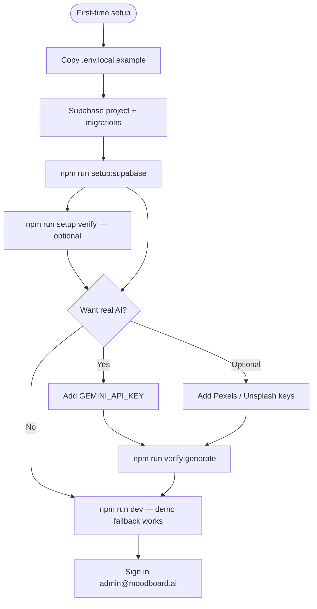

# Manual Setup Checklist

Everything **you** must do by hand. The codebase handles the rest.

Use this as your single source of truth after the Supabase + Gemini + Vercel work.

Back to [README](../README.md) · Supabase: [SUPABASE_SETUP](SUPABASE_SETUP.md) · Gemini: [GEMINI_SETUP](GEMINI_SETUP.md) · Deploy: [DEPLOY](DEPLOY.md)



---

## What The Code Already Does (No Action Needed)

- Supabase auth, boards, settings API routes
- Route protection (`/app`, `/settings`)
- Board generation via `POST /api/generate/draft` → `POST /api/generate/enrich` (Gemini or demo fallback)
- Template generation through the same draft → enrich pipeline
- Demo user seed script
- Local → Supabase migration on first login

---

## One-Time: Supabase

| Step | Action | Status |
|------|--------|--------|
| 1 | Create project at [supabase.com](https://supabase.com) | You did this |
| 2 | Run migrations through [`032_board_view_counts.sql`](../supabase/migrations/032_board_view_counts.sql) in SQL Editor (or `npx supabase db push`) | Verify tables exist |
| 3 | Copy 3 keys into `.env.local` | You did this |
| 4 | **Authentication → Providers → Email** → disable **Confirm email** | Check if not done |
| 5 | **Authentication → URL Configuration** → Site URL `http://localhost:3000`; add `http://localhost:3000/auth/callback` for password reset | Check if not done |
| 6 | Run `npm run setup:supabase` then `npm run setup:verify` | Should pass |

Demo login: `admin@moodboard.ai` / `moodboard123`

Full guide: [`docs/SUPABASE_SETUP.md`](SUPABASE_SETUP.md)

---

## One-Time: Gemini (Free AI)

| Step | Action |
|------|--------|
| 1 | Get free key at [aistudio.google.com/apikey](https://aistudio.google.com/apikey) |
| 2 | Add `GEMINI_API_KEY=AIza...` to `.env.local` |
| 3 | **Remove** `OPENAI_API_KEY` from `.env.local` (deprecated) |
| 4 | Run `npm run verify:generate` |
| 5 | Restart `npm run dev` |

Full guide: [`docs/GEMINI_SETUP.md`](GEMINI_SETUP.md)

---

## One-Time: Vercel (Production)

| Step | Action |
|------|--------|
| 1 | Connect GitHub repo to Vercel |
| 2 | Add env vars (see table below) |
| 3 | **Delete** `OPENAI_API_KEY` from Vercel if present |
| 4 | **Redeploy** after any env change |
| 5 | Supabase → **URL Configuration** → set your `https://your-app.vercel.app` domain and `/auth/callback` redirect URL |
| 6 | Smoke test live site |

### Vercel Environment Variables

| Variable | Sensitive? | Mark as Safe? |
|----------|------------|---------------|
| `NEXT_PUBLIC_SUPABASE_URL` | No | Yes |
| `NEXT_PUBLIC_SUPABASE_ANON_KEY` | No | **Yes** (designed to be public) |
| `SUPABASE_SERVICE_ROLE_KEY` | **Yes** | No |
| `GEMINI_API_KEY` | **Yes** | No |

Full guide: [`docs/DEPLOY.md`](DEPLOY.md)

---

## Never Commit

| File | Contains |
|------|----------|
| `.env.local` | All secrets |

Confirm: `git check-ignore -v .env.local` should show a match.

---

## Before Every GitHub Push

```bash
npm run setup:supabase    # optional if already verified
npm run setup:verify      # optional — tables, RLS, env wiring
npm run verify:generate   # optional
npm run lint
npm run typecheck
npm run build
git status                # .env.local must NOT appear
```

---

## Local Smoke Test (5 Minutes)

1. `npm run dev` → [http://localhost:3000](http://localhost:3000)
2. Sign in with demo account
3. `/app/new` → generate a board → see **Powered by Gemini** (if key set)
4. Refresh → board persists
5. `/templates` → use a template → board created
6. `/settings` → change theme → persists after sign-out/in
7. `/sign-in` → **Forgot password?** → request reset email (complete update-password in the same browser after clicking the link)

---

## Production Smoke Test

Same as local, on your Vercel URL.

---

## If Something Breaks

| Symptom | Fix |
|---------|-----|
| Redirect loop on sign-in | Supabase Site URL / Redirect URLs don’t match your domain |
| Password reset link invalid | Add `/auth/callback` to Supabase redirect URLs; match Site URL to your domain; use fresh link in same browser |
| 401 on boards/settings | Missing or wrong Supabase env vars; redeploy |
| Demo generation only | `GEMINI_API_KEY` not set or not redeployed |
| Gemini quota error | Free tier limit; wait or remove key for demo mode |
| Sign-up asks for email confirm | Disable confirm email in Supabase |

---

## What You Do NOT Need To Do

- Run OpenAI setup (removed)
- Pay for OpenAI API
- Redesign the landing page (you preferred the current design)
- Set up a separate database server (Supabase handles it)
- Commit `.env.local`
