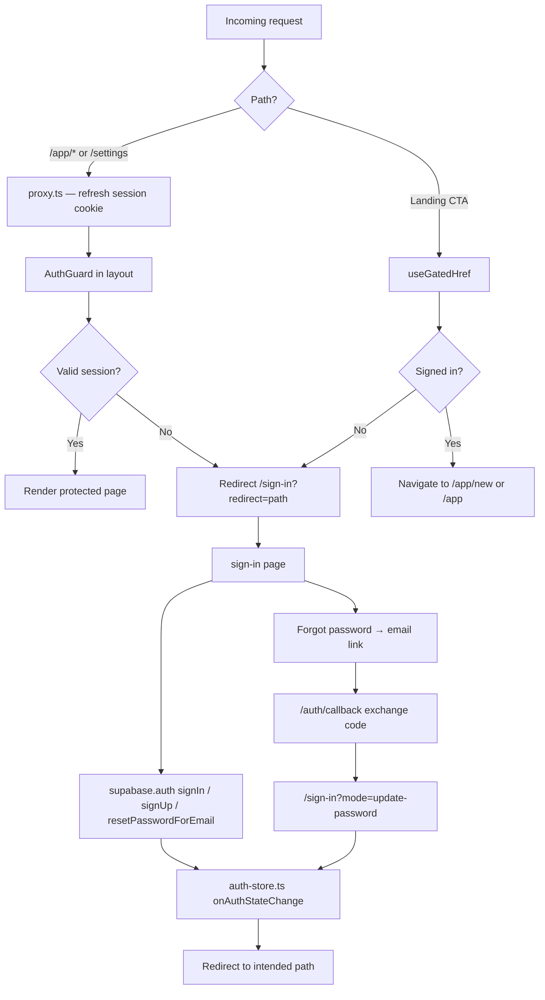
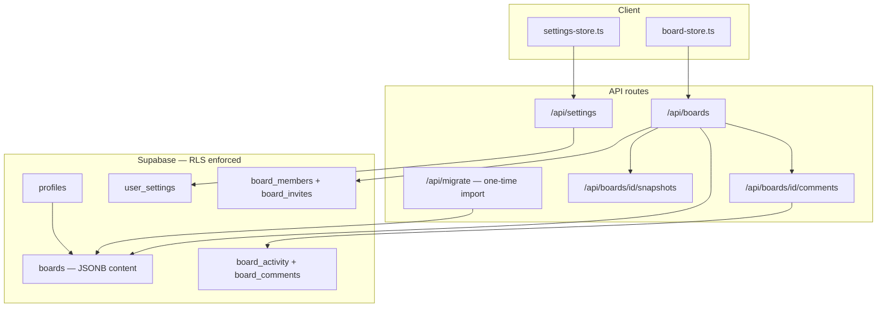
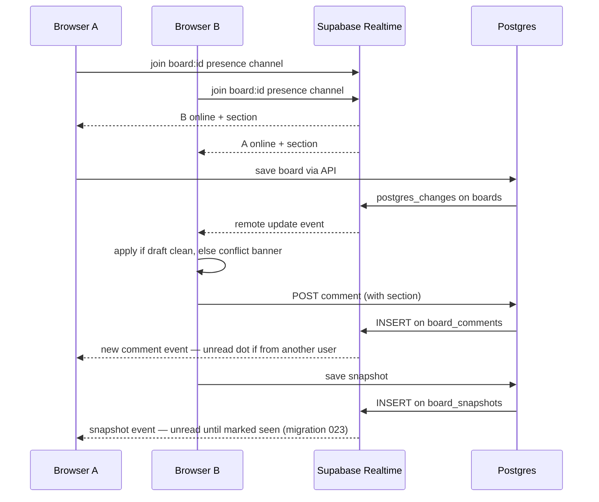
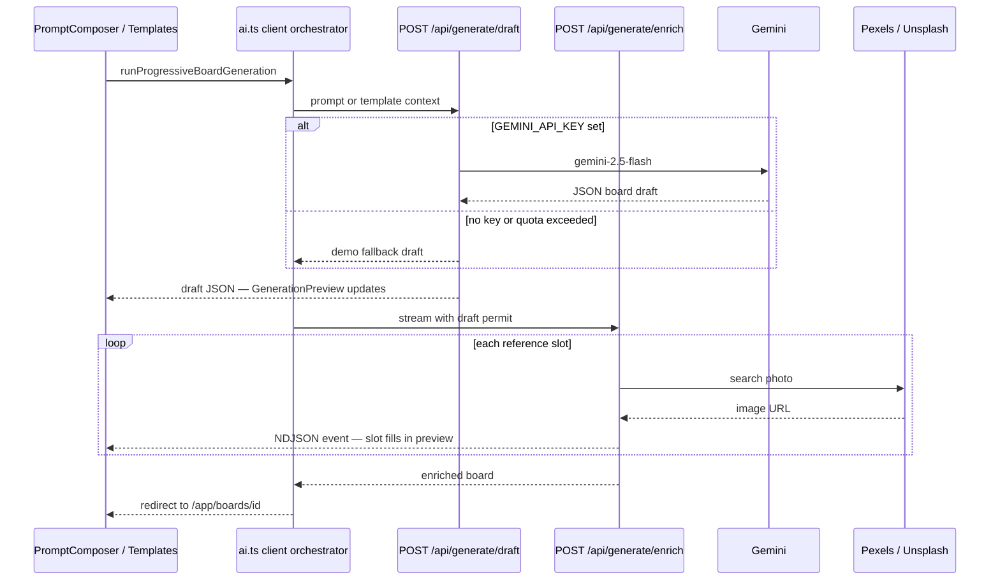
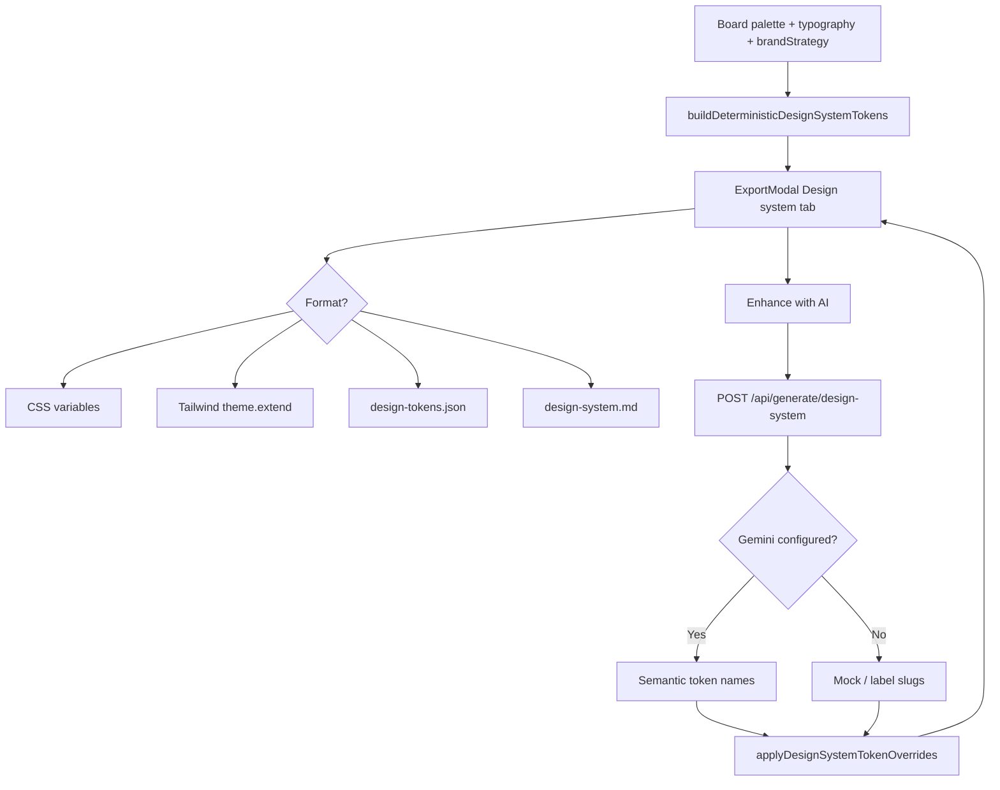
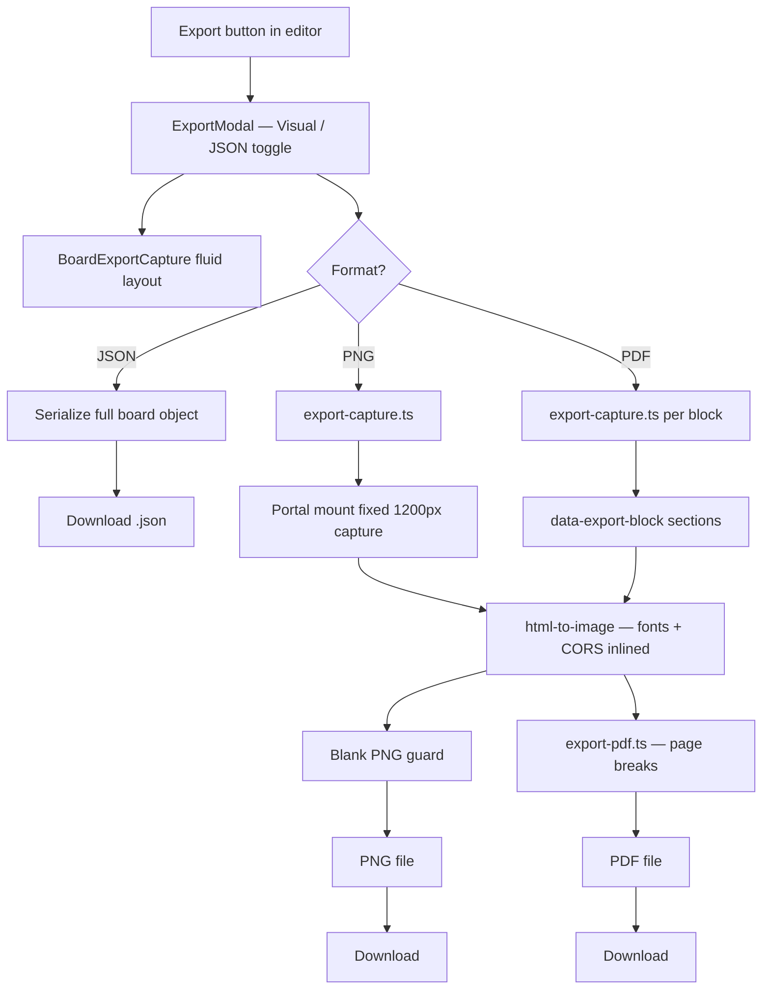

# Systems

Core subsystems: authentication, persistence, AI generation, and visual export.

Back to [README](../README.md) · Setup: [SUPABASE_SETUP](SUPABASE_SETUP.md) · [GEMINI_SETUP](GEMINI_SETUP.md) · [DEPLOY](DEPLOY.md)

Diagrams: [auth flow](#auth-flow) · [persistence](#persistence-flow) · [realtime](#realtime--collaboration) · [AI pipeline](#generation-pipeline) · [export](#export-pipeline) · User flows: [README § App flow](../README.md#app-flow)

## Authentication & gated landing CTAs

User login / authentication and gated CTAs use **Supabase Auth** with cookie-based sessions. The auth store (`src/lib/auth-store.ts`) still exposes `subscribeAuth`, `readAuthState`, `hydrateAuthStore`, and `signUp` / `signIn` / `signOut` for UI components.

**What was built:**

- **Auth store** — `src/lib/auth-store.ts`. Subscribes to `supabase.auth.onAuthStateChange`, maps sessions to `AuthUser`, and wraps Supabase sign-up/sign-in/sign-out, demo sign-in, **forgot password** (`requestPasswordReset`), and **update password** (`updatePassword`). Demo account: `admin@moodboard.ai` / `moodboard123` (seed via `npm run db:seed-demo`).
- **Auth page** — a single consolidated page in the route group `src/app/(auth)/` at `/sign-in`, with an in-page **Sign in / Create account** toggle (the header's "Get started" deep-links via `/sign-in?mode=sign-up`). Modes: sign-in, sign-up, forgot-password, update-password. It reads a `?redirect=` target (sanitized to internal paths) via `useSearchParams` inside a `<Suspense>` boundary, has a password show/hide toggle, a **Forgot password?** link, a one-click demo-account button, inline validation/errors, loading states, and toast feedback. A premium split-screen layout and a pre-login theme toggle live in `src/app/(auth)/layout.tsx`.
- **Auth callback** — `src/app/auth/callback/route.ts` exchanges Supabase auth codes for a session (`exchangeCodeForSession`) and redirects to `?next=` (password reset lands on `/sign-in?mode=update-password`). Requires `/auth/callback` in Supabase redirect URLs.
- **Route gating** — `src/components/auth/AuthGuard.tsx` wraps the `/app` and `/settings` layouts. It shows a loading state while the session resolves, and redirects unauthenticated users to `/sign-in?redirect=<intended path>`.
- **Gated landing CTAs** — `useGatedHref` (`src/components/auth/use-gated-href.ts`) makes the CTAs in `src/components/landing/Hero.tsx` ("Start a board" → `/app/new`, "View my boards" → `/app`) and `src/components/landing/CTASection.tsx` ("Begin your first board" → `/app/new`) route through `/sign-in` when unauthenticated, then bounce to the intended destination after signing in.
- **Per-user boards** — `src/lib/board-store.ts` loads boards from `/api/boards` for the signed-in user, driven by `src/components/layout/BoardStoreBootstrap.tsx`. New accounts start with an empty workspace; legacy localStorage data is imported once via `/api/migrate`.
- **Account menu** — `src/components/layout/AccountMenu.tsx` in the top bar shows a "Signed in as" identity plus a **Sign out** action. The landing header gains a **Sign in** / **Get started** / **Open app** entry point.

Auth is now backed by **Supabase Auth** (see [Database & Persistence](#database--persistence)). The auth store API (`signUp`, `signIn`, `signOut`, `subscribeAuth`) is unchanged for UI components.

### Auth flow

**Key files:** [`auth-store.ts`](../src/lib/auth-store.ts) · [`AuthForm.tsx`](../src/components/auth/AuthForm.tsx) · [`AuthGuard.tsx`](../src/components/auth/AuthGuard.tsx) · [`auth/callback/route.ts`](../src/app/auth/callback/route.ts) · [`proxy.ts`](../src/proxy.ts) · [`use-gated-href.ts`](../src/components/auth/use-gated-href.ts)

---

## Database & persistence

User-scoped data is stored in **Supabase (Postgres + Auth)** with Row Level Security. Client stores keep the same `useSyncExternalStore` API; persistence is handled via API routes.

**Setup:** Follow the full guide in [SUPABASE_SETUP.md](SUPABASE_SETUP.md). Short version:

1. Create a Supabase project at [supabase.com](https://supabase.com).
2. Run migrations in [`supabase/migrations/`](../supabase/migrations/) through `024` in the SQL Editor (or follow [SUPABASE_SETUP.md](SUPABASE_SETUP.md) / [DEPLOY.md](DEPLOY.md) for the full ordered list).
3. Copy API keys into `.env.local` (see [`.env.local.example`](../.env.local.example)).
4. Disable **Confirm email** under Authentication → Providers → Email.
5. Run `npm run setup:supabase` (verifies tables + seeds demo user).
6. Run `npm run dev` and sign in with `admin@moodboard.ai` / `moodboard123`.

**What was built:**

- **Schema** — `profiles`, `boards`, `user_settings` tables with RLS (`supabase/migrations/001_initial.sql`). Profile + default settings are created automatically on sign-up via trigger.
- **API routes** — `src/app/api/boards/`, `src/app/api/settings/`, `src/app/api/migrate/` (one-time localStorage import).
- **Board store** — `src/lib/board-store.ts` fetches and mutates via API with optimistic updates. New users start with an empty workspace.
- **Settings store** — `src/lib/settings-store.ts` is per-user; theme is mirrored to a cookie + local cache. `SettingsBootstrap` (root layout) keeps theme consistent across landing and app.
- **Proxy** — `src/proxy.ts` protects `/app` and `/settings`, refreshing the Supabase session on each request.
- **Migration** — `src/lib/local-migration.ts` imports legacy `localStorage` boards/settings on first authenticated load, then clears old keys.
- **Sidebar collapse** remains in `localStorage` (device UI preference, not account data).

### Persistence flow

### Realtime & collaboration

**Collaboration read state:** [`collaboration-read-state.ts`](../src/lib/collaboration-read-state.ts) centralizes unread logic. Own content is always read; timestamps on `board_collaboration_state` track last-read for comments, activity, and snapshots. API routes in [`board-collaboration-state.ts`](../src/lib/db/board-collaboration-state.ts) expose counts and mark-read actions.

**Section metadata:** [`editor-sections.ts`](../src/lib/editor-sections.ts) — shared section ids, labels, descriptions, icons, and accent tokens for editor tabs, comments, activity, and replay.

---

## AI generation

Prompt and template board creation use a **staged progressive pipeline** with authenticated sessions:

1. **`POST /api/generate/draft`** — Gemini (or demo) returns creative direction with SVG placeholder references.
2. **`POST /api/generate/enrich`** — streams NDJSON events as Pexels photos resolve one-by-one.
3. **`GET /api/generate`** — returns configured provider (`gemini` vs `mock`).

The client shows a live preview as the draft arrives, then fills reference slots progressively ([`GenerationPreview`](../src/components/creation/GenerationPreview.tsx)).

**Setup:**

1. Optionally add `GEMINI_API_KEY` to `.env.local` (see [`.env.local.example`](../.env.local.example) and [GEMINI_SETUP.md](GEMINI_SETUP.md)).
2. Optionally add `PEXELS_API_KEY` and `UNSPLASH_ACCESS_KEY` for stock reference photos ([REFERENCE_PHOTOS.md](REFERENCE_PHOTOS.md)).
3. Run `npm run verify:generate` to confirm Gemini connectivity or mock fallback.
4. Create a board at `/app/new` or from `/templates`.

**Model fallback chain** (free tier):

1. `gemini-2.5-flash` (primary)
2. `gemini-2.5-flash-lite` (if primary is busy / over quota)
3. Demo generation (if both fail — board still created)

> `gemini-2.0-flash` has **0 free-tier quota** — not used.

**What was built:**

- **Server** — [`src/lib/ai-generate.ts`](../src/lib/ai-generate.ts) draft generation (Gemini JSON + demo fallback); template drafts use full template context via `buildTemplateGenerationPrompt()`; [`src/lib/enrich-board-references.ts`](../src/lib/enrich-board-references.ts) sequential Pexels enrichment.
- **API** — [`src/app/api/generate/draft/route.ts`](../src/app/api/generate/draft/route.ts) (rate-limited draft); [`src/app/api/generate/enrich/route.ts`](../src/app/api/generate/enrich/route.ts) (NDJSON stream); enrich requires a draft permit from [`src/lib/generate-enrich-permit.ts`](../src/lib/generate-enrich-permit.ts).
- **Client** — [`PromptComposer`](../src/components/creation/PromptComposer.tsx) and [`templates/page.tsx`](../src/app/templates/page.tsx) orchestrate draft → enrich via [`runProgressiveBoardGeneration`](../src/lib/ai.ts); [`GenerationPreview`](../src/components/creation/GenerationPreview.tsx) shows live draft + progressive reference fill; **Powered by Gemini** badge when configured.

**Production:** Add `GEMINI_API_KEY` and `PEXELS_API_KEY` to Vercel. See [DEPLOY.md](DEPLOY.md).

### Generation pipeline

**On-demand suggestions** (inside editor): `POST /api/generate/palette` · `POST /api/generate/typography` · `POST /api/generate/brand`

**Design system export** (Export modal): deterministic tokens from palette + typography; optional `POST /api/generate/design-system` for AI-enhanced semantic token names (Gemini with mock fallback).

**Public profiles:** `GET /api/profile/[id]` returns workspace identity (from `profiles` + `user_settings`) and shared boards only. Discover cards include `creatorId` for profile links.

---

## Visual board export

The board editor **Export** action opens [`ExportModal`](../src/components/shared/ExportModal.tsx) with a **live preview** before download.

**Formats:**

| Format | Contents |
|--------|----------|
| **JSON** | Full board object (metadata, notes, tags, prompt, etc.) |
| **PNG** | Single image moodboard summary |
| **PDF** | Printable moodboard with smart page breaks between sections |
| **Design system** | CSS variables, Tailwind config snippet, tokens JSON, or Markdown spec |

**Visual export includes:** title, summary, mood, tone, tags, palette, typography, references, notes, and brand strategy (when saved).

**Design system export includes:** semantic color and typography tokens derived from the board palette and type pairings, plus brand strategy when saved. Deterministic slugification works offline; **Enhance with AI** calls Gemini for semantic names when configured.

**What was built:**

- **Layout** — [`BoardExportCapture`](../src/components/board/BoardExportCapture.tsx) with inline styles for reliable `html-to-image` capture; `fixed` (1200px) for export, `fluid` for in-modal preview
- **Capture pipeline** — [`export-capture.ts`](../src/lib/export-capture.ts): body-portal mount on export, CORS-safe image inlining, font/image readiness, blank-PNG validation
- **PDF assembly** — [`export-pdf.ts`](../src/lib/export-pdf.ts): section blocks (`data-export-block`) captured separately; page breaks keep reference rows and note cards intact
- **Design system generation** — [`export-design-system.ts`](../src/lib/export-design-system.ts): CSS, Tailwind, tokens JSON, Markdown; [`ai-generate-design-system.ts`](../src/lib/ai-generate-design-system.ts) + `POST /api/generate/design-system` for AI token naming
- **Preview UX** — two-panel modal with **Visual / JSON / Design system** tabs; PNG/PDF buttons export independently (only the active button shows loading state)

**Touch:** [`ExportModal`](../src/components/shared/ExportModal.tsx), [`BoardExportCapture`](../src/components/board/BoardExportCapture.tsx), [`export-capture.ts`](../src/lib/export-capture.ts), [`export-pdf.ts`](../src/lib/export-pdf.ts), [`export-design-system.ts`](../src/lib/export-design-system.ts).

### Design system export

### Export pipeline

